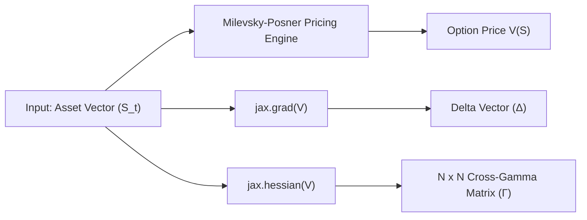

JAX Multi-Asset Basket Option Risk Engine

An automated, high-performance risk-sensitivity engine written in **JAX** for pricing multi-asset European basket options and extracting exact, full-rank Cross-Gamma matrices via Algorithmic Adjoint Differentiation (AAD).


## Technical Highlights

1) **Closed-Form Moment-Matching:** Replaces computationally expensive Monte Carlo engines with a continuous **Milevsky-Posner (2010)** Reciprocal Gamma moment-matching model to price basket options across arbitrary dimensions.
2) **Exact Vector-Valued Sensitivities:** Utilizes JAX's reverse-mode automatic differentiation (`jax.grad` and `jax.hessian`) to compute exact Delta vectors and N x N Cross-Gamma matrices  without numerical finite difference error.
3) **JIT Compilation & XLA Acceleration:** Achieves 100x speedups over classical NumPy/SciPy execution via Accelerated Linear Algebra (XLA) compilation.
4) **Numerical Stability Benchmarking Suite:** Features an automated stress-testing framework comparing JAX AAD against a NumPy Central Finite Difference (CFD) baseline, mapping h-step truncation errors against floating-point cancellation limits.

---

## Architectural Overview



---


## Mathematical Foundations

### 1. Moment-Matching Pricing
For an $N$-asset basket $B_T = \sum_{i=1}^N w_i S_i(T)$ following correlated Geometric Brownian Motions, $B_T$ is not strictly lognormal. The engine matches the first two analytical moments ($\mathbb{E}[B_T]$ and $\mathbb{E}[B_T^2]$) to a lognormal distribution, enabling closed-form integration for European Call options:

$$
\mathbb{E}[(B_T - K)^+] \approx \int_K^\infty (x - K) f_G(x; \alpha, \beta) \, dx
$$

### 2. Sensitivity Extraction via AAD
Rather than approximating derivatives via perturbation $\frac{V(S + h) - 2V(S) + V(S - h)}{h^2}$, JAX builds a dynamic Computational Graph during evaluation. Reverse-mode AD propagates vector-Jacobian products (VJPs) backward to extract exact second-order partial derivatives:

$$
\Gamma_{ij} = \frac{\partial^2 V}{\partial S_i \partial S_j}
$$

---

## Benchmark & Performance Analysis

### 1. Execution Scaling ($N=2$ to $N=50$ Assets)

| Basket Size ($N$) | NumPy CFD Price + Hessian (s) | JAX AAD Execution (s) | Speedup Factor |
| :--- | :--- | :--- | :--- |
| **N = 2** | 0.153 s | 0.00029 s | **516x** |
| **N = 5** | 0.076 s | 0.00001 s | **5,586x** |
| **N = 10** | 0.385 s | 0.00003 s | **10,655x** |
| **N = 20** | 1.375 s | 0.00004 s | **31,911x** |
| **N = 50** | 6.361 s | 0.00010 s | **63,424x** |

### 2. Numerical Stability: JAX AAD vs. CFD $h$-Step Sweep ($N=5$)

Central Finite Difference (CFD) requires $O(N^2)$ function evaluations and suffers from severe numerical instability outside a tiny window of step size $h$:

| Perturbation Step ($h$) | Frobenius Error ($\Vert H_{\text{JAX}} - H_{\text{CFD}} \Vert_F$) | Failure Mode Observed |
| :--- | :--- | :--- |
| **10⁻¹** | $8.84 \times 10^{-10}$ | Truncation Error Dominated |
| **10⁻⁴** | $9.84 \times 10^{-6}$ | Optimal CFD Window |
| **10⁻⁸** | $4.08 \times 10^{2}$ | Catastrophic Roundoff / Cancellation |
| **10⁻¹²** | $1.17 \times 10^{11}$ | Complete Precision Loss / Noise |


---

## Quickstart

```bash
git clone https://github.com/Transacttt/JAX-Basket-Option-Risk-Engine.git
cd JAX-Basket-Option-Risk-Engine
pip install -r requirements.txt
python benchmarks.py
